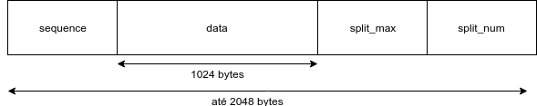

# streaming-redes2
Trabalho de Redes 2 - Streaming de dados via UDP

### Aplicação
Nossa aplicação é um streaming de artigos gerados aleatoriamente. O servidor usa uma cadeia de Markov (disponibilizada aqui) que foi obtida a partir de 10000 artigos. 
Os clientes podem se conectar ao servidor e recebem os artigos, o usuário pode digitar o id do artigo que ele mais gostar e salvar em um arquivo output.txt. 
Inspirado no famoso SCIgen que tinha como objetivo mandar artigos artificiais para conferências com reputação questionáves (uma das conferências até chegou a aceitar um).

### Estrutura do trabalho
O trabalho é dividido em três arquivos:
`server.py`, que implementa o servidor
`client.py`, que implementa o cliente, e
`lerolero.py`, que gera automaticamente artigos que são enviados para o cliente.

O servidor possui duas threads: uma que só escuta os pedidos dos clientes para receber streaming, e uma que só envia os dados dos clientes que pediram.

Os clientes fazem um pedido para começar a receber dados para o servidor. O servidor, então, insere esse cliente na lista de clientes ativos que irão receber os dados do streaming, e passa a enviar os dados a todos os clientes ativos por um loop. Esses dados são artigos, gerados pelo arquivo lerolero.py. O servidor possui um loop para enviar esses dados; a cada iteração do loop, o servidor recebe um artigo gerado pelo lerolero.py e então envia para toda a lista de clientes ativos.

Os artigos possuem tamanho máximo de 1024 bytes e os pacotes possuem tamanho máximo de 2048. Caso os dados ultrapassem esse tamanho, eles serão divididos em fragmentos. Os pacotes são estruturados dessa maneira:

Nos nossos testes, não tivemos nenhum pacote perdido ou com ordem trocada, mesmo rodando em multiplas maquinas do DINF. 

`sequence` é o número do pacote em si, incrementado em todo pacote enviado desde o envio do programa. Ele é sempre incrementado, mesmo quando os artigos precisam ser divididos em mais de um pacote.

`data` é o artigo em si.

`split_max` é o número de fragmentos que o artigo precisou ter.

`split_num` é o número do fragmento do pacote. Por exemplo, se o pacote foi dividido em 5 fragmentos, o segundo fragmento terá split_num = 2 e split_max = 5.

## Arquivos de logs:
execução de um servidor e um cliente: `client1-1p1.log` `server-1p1.log`

execução de um servidor e 3 clientes: `server-3.log` `client1-3.log` `client2-3.log` `client3-3.log` 

execução de um servidor e um cliente com muitas mensagens: `client1-1p1-longo.log` `server-1p1-longo.log`

### Instruções de execução
python3 client.py [-h] [--host HOST] [--port PORT] [--log_path LOG_PATH]
ex: `python3 client.py --host localhost --port 55000 --log_path ../log/client_log.txt`

python3 server.py [-h] [--interval INTERVAL] [--host HOST] [--port PORT] [--log_path LOG_PATH]
ex: `python3 server.py --interval 0.5 --host 127.0.1.1 --log_path ../log/server_log.txt`
